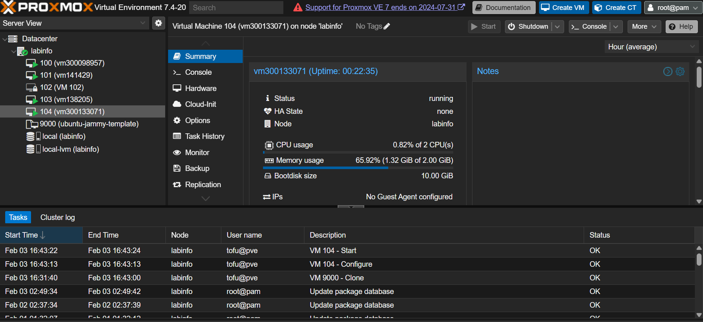
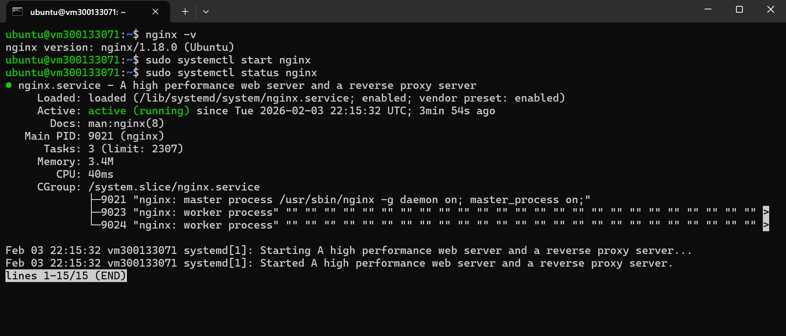

# Infrastructure as Code (IaC) – Exercices OpenTofu & Proxmox

## 👤 Étudiant

- Identifiant Boréal : **300133071**
- Cours : Programmation système / DevOps
- Thème : **Infrastructure as Code (IaC)**

---

## 📌 Objectif du laboratoire

L’objectif de ce laboratoire est de mettre en pratique le concept d’**Infrastructure as Code (IaC)** en utilisant **OpenTofu** avec **Proxmox VE 7** afin de déployer automatiquement une machine virtuelle Linux via une configuration déclarative.

Ce travail permet de :

- Comprendre la différence entre configuration manuelle et IaC
- Décrire une infrastructure sous forme de code
- Automatiser la création d’une VM
- Utiliser un provider OpenTofu réel (Proxmox)
- Déployer un service web accessible depuis un navigateur

---

## 🧠 Concepts abordés

- Infrastructure as Code (IaC)
- Approche déclarative
- Providers OpenTofu
- Virtualisation avec Proxmox VE
- Cloud-Init
- Installation automatisée de services (NGINX)
- Gestion des variables et des secrets
- Automatisation et reproductibilité
- Vérification fonctionnelle via navigateur

---

## 🛠️ Outils utilisés

- **OpenTofu** (compatible Terraform)
- **Proxmox VE 7**
- **Provider Telmate Proxmox**
- **Git & GitHub**
- **SSH**
- **Ubuntu Server (Cloud Image)**
- **NGINX** (serveur web)

---

## 📁 Structure du projet

```text
🆔/
├── provider.tf
├── main.tf
├── variables.tf
├── terraform.tfvars   (non versionné)
└── README.md
```

## contenu de terraform.tfvars

```text
pm_vm_name      = "vm300133071"
pm_ipconfig0    = "ip=10.7.237.194/23,gw=10.7.237.1"
pm_nameserver   = "10.7.237.3"
pm_url          = "https://10.7.237.16:8006/api2/json"
pm_token_id     = "tofu@pve!opentofu"
pm_token_secret = "4fa24fc3-bd8c-4916-ba6e-09a8aecc3b00"

```

## Déploiement

Commandes utilisées :

```text
tofu init
tofu plan
tofu apply

```

 
via 
<a href="https://10.7.237.16:8006/#v1:0:18:4:::::::" target="_blank" rel="noopener noreferrer">Serveur Promox</a>

## 🔍 Vérification

Connexion à la VM via SSH :

```powershell

ssh -i ~/.ssh/williamkey.pk `
  -o StrictHostKeyChecking=no `
  -o UserKnownHostsFile=/tmp/ssh_known_hosts_empty `
  ubuntu@10.7.237.194

```

## Accès web

Depuis un navigateur, saisir l’adresse IP de la VM :

http://10.7.237.194:80



# ✅ Résultats obtenus

VM Ubuntu déployée automatiquement

Infrastructure reproductible

Aucune configuration manuelle sur Proxmox

Déploiement rapide et fiable

Infrastructure entièrement décrite par du code
