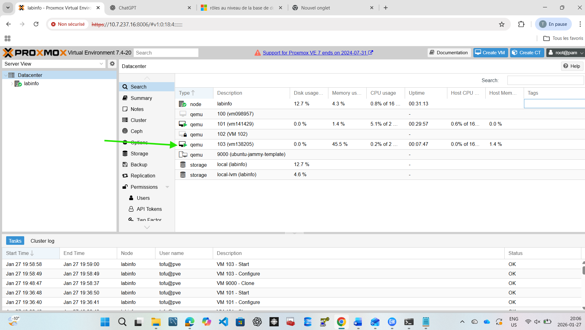

# Infrastructure as Code (IaC) – Exercices OpenTofu & Proxmox

## 👤 Étudiant

- Identifiant : **300138205**
- Nom: Taylor
- Cours : Programmation système 
- Thème : **Infrastructure as Code (IaC)**


* terraform.tfvars

```lua
pm_vm_name      = "vm138205"   
pm_ipconfig0    = "ip=10.7.237.196/23,gw=10.7.237.1"
pm_nameserver   = "10.7.237.3"    
pm_url          = "https://10.7.237.16:8006/api2/json"
pm_token_id     = "tofu@pve!opentofu"
pm_token_secret = "4fa24fc3-bd8c-4916-ba6e-09a8aecc3b00"
sshkeys = [
  file("~/.ssh/taylor.pub"),
  file("~/.ssh/b300098957@ramena.pub")
]
```

# Infrastructure as Code (IaC)
# 📌 Introduction

Traditionnellement, l’administration système reposait sur des actions manuelles : installations à la main, configurations via interface graphique, documentation incomplète et environnements difficiles à reproduire.
Résultat classique :

👉 L’Infrastructure as Code (IaC) apporte une solution moderne à ces problèmes.

# 🧩 Définition

L’Infrastructure as Code (IaC) est une approche qui consiste à décrire, déployer et gérer une infrastructure informatique à l’aide de code plutôt que par des manipulations manuelles.

## ⚙️ Rôle de l’IaC

L’IaC se situe entre le système et les applications :

elle ne programme pas le noyau

elle pilote l’infrastructure via des API, services système, hyperviseurs ou clouds

elle transforme l’infrastructure en programme

## Déploiement

Commandes utilisées :

```text
tofu init
tofu plan
tofu apply

```




