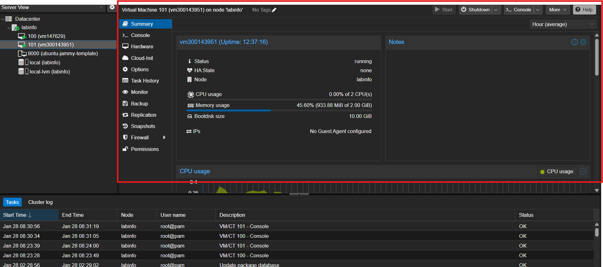

# Rapport de laboratoire - Infrastructure as Code (IaC)

## 📋 Informations générales

**Cours :** INF1102-201-26H-03  
**Étudiant :** Frank Kadji  
**ID Boréal :** 300143951  
**Date :** 27 janvier 2026  
**Sujet :** Déploiement automatisé avec OpenTofu et Proxmox

---

## 📖 Table des matières

1. [Introduction](#introduction)
2. [Objectifs](#objectifs)
3. [Infrastructure et configuration](#infrastructure-et-configuration)
4. [Fichiers de configuration OpenTofu](#fichiers-de-configuration-opentofu)
5. [Déploiement](#déploiement)
6. [Problèmes rencontrés et solutions](#problèmes-rencontrés-et-solutions)
7. [Conclusion](#conclusion)

---

## 1. Introduction

L'**Infrastructure as Code (IaC)** est une approche moderne de gestion d'infrastructure qui consiste à décrire, déployer et gérer des ressources informatiques à l'aide de fichiers de configuration versionnés plutôt que par des actions manuelles. Cette méthode permet d'automatiser le déploiement, d'assurer la reproductibilité et de réduire les erreurs humaines.

Ce rapport documente la réalisation d'un laboratoire pratique utilisant **OpenTofu** (fork open-source de Terraform) pour déployer automatiquement une machine virtuelle Ubuntu sur un serveur **Proxmox VE 7**.

### Avantages de l'IaC

| Avantage | Description |
|----------|-------------|
| **Reproductibilité** | Même infrastructure, partout |
| **Automatisation** | Déploiement sans intervention manuelle |
| **Versionnement** | Git = historique, rollback |
| **Fiabilité** | Moins d'erreurs humaines |
| **Rapidité** | Déploiement en minutes |
| **Auditabilité** | Tout est traçable |

---

## 2. Objectifs

Les objectifs de ce laboratoire sont :

- ✅ Comprendre les concepts fondamentaux de l'IaC
- ✅ Installer et configurer OpenTofu
- ✅ Créer des fichiers de configuration déclaratifs
- ✅ Déployer automatiquement une VM sur Proxmox
- ✅ Gérer l'authentification SSH avec Cloud-Init
- ✅ Diagnostiquer et résoudre les problèmes de déploiement

---

## 3. Infrastructure et configuration

### 3.1 Environnement

| Composant | Valeur |
|-----------|--------|
| **Serveur Proxmox** | 10.7.237.28 |
| **ID Étudiant** | 300143951 |
| **Nom de la VM** | vm300143951 |
| **Adresse IP VM** | 10.7.237.206/23 |
| **Passerelle** | 10.7.237.1 |
| **Serveur DNS** | 10.7.237.3 |
| **Token API** | tofu@pve!opentofu |
| **Token Secret** | f728d095-1506-490f-81b1-ecdafdfb8ef9 |

### 3.2 Configuration matérielle de la VM

- **CPU :** 2 cores
- **Mémoire :** 4096 MB (4 GB)
- **Disque :** 20 GB (stockage local-lvm)
- **Réseau :** Bridge vmbr0 avec carte virtio
- **OS :** Ubuntu 22.04 (Jammy) via Cloud-Init

---

## 4. Fichiers de configuration OpenTofu

### 4.1 Structure du projet

```
300143951/
├── provider.tf
├── main.tf
├── variables.tf
└── terraform.tfvars
```

### 4.2 provider.tf

Configuration du fournisseur Proxmox :

```hcl
terraform {
  required_providers {
    proxmox = {
      source  = "telmate/proxmox"
      version = ">= 2.9.0"
    }
  }
}

provider "proxmox" {
  pm_api_url          = var.pm_url
  pm_api_token_id     = var.pm_token_id
  pm_api_token_secret = var.pm_token_secret
  pm_tls_insecure     = true
}
```

### 4.3 variables.tf

Déclaration des variables :

```hcl
variable "pm_vm_name" {
  type = string
}

variable "pm_ipconfig0" {
  type = string
}

variable "pm_nameserver" {
  type = string
}

variable "pm_url" {
  type = string
}

variable "pm_token_id" {
  type = string
}

variable "pm_token_secret" {
  type      = string
  sensitive = true
}
```

### 4.4 terraform.tfvars

Valeurs des variables (informations sensibles) :

```hcl
pm_vm_name      = "vm300143951"
pm_ipconfig0    = "ip=10.7.237.206/23,gw=10.7.237.1"
pm_nameserver   = "10.7.237.3"
pm_url          = "https://10.7.237.28:8006/api2/json"
pm_token_id     = "tofu@pve!opentofu"
pm_token_secret = "f728d095-1506-490f-81b1-ecdafdfb8ef9"
```

⚠️ **Note :** Ce fichier ne doit jamais être commité dans Git car il contient des informations sensibles.

### 4.5 main.tf

Définition de la ressource VM :

```hcl
resource "proxmox_vm_qemu" "vm1" {
  name        = var.pm_vm_name
  target_node = "labinfo"
  clone       = "ubuntu-jammy-template"

  cores   = 2
  sockets = 1
  memory  = 4096

  scsihw = "virtio-scsi-pci"

  disk {
    size    = "20G"
    type    = "scsi"
    storage = "local-lvm"
  }

  network {
    model  = "virtio"
    bridge = "vmbr0"
  }

  os_type = "cloud-init"

  ipconfig0  = var.pm_ipconfig0
  nameserver = var.pm_nameserver

  ciuser  = "ubuntu"
  sshkeys = <<EOF
${file("C:/Users/franc/.ssh/id_ed25519.pub")}
${file("C:/Users/franc/.ssh/cle_publique_du_prof.pub")}
EOF
}
```

---

## 5. Déploiement

### 5.1 Initialisation

Commande pour initialiser le projet :

```bash
tofu init
```

Cette commande :
- Télécharge le provider Proxmox (telmate/proxmox v2.9.14)
- Initialise le backend
- Crée le fichier `.terraform.lock.hcl`

### 5.2 Planification

Commande pour visualiser les changements :

```bash
tofu plan
```

Cette commande affiche un résumé des ressources qui seront créées sans les appliquer réellement. Elle permet de vérifier la configuration avant le déploiement.

### 5.3 Application

Commande pour déployer la VM :

```bash
tofu apply
```

Après confirmation (`yes`), OpenTofu crée la VM sur le serveur Proxmox.

### 5.4 Connexion à la VM

Une fois la VM déployée, connexion via SSH :

```bash
ssh -i ~/.ssh/id_ed25519 ubuntu@10.7.237.206
```

---

## 6. Problèmes rencontrés et solutions

### 6.1 Installation d'OpenTofu sur Windows

**Problème :**  
La commande `tofu` n'était pas reconnue après installation via Chocolatey avec `choco install tofu`.

**Solution :**  
Le package n'existe pas sous le nom "tofu" dans Chocolatey. L'installation correcte est :

```powershell
choco install opentofu
```

---

### 6.2 Commande `touch` inexistante sur PowerShell

**Problème :**  
La commande `touch provider.tf main.tf variables.tf terraform.tfvars` échouait sur Windows PowerShell.

**Solution :**  
Utilisation de la commande PowerShell équivalente :

```powershell
New-Item provider.tf, main.tf, variables.tf, terraform.tfvars
```

Ou version courte :

```powershell
ni provider.tf, main.tf, variables.tf, terraform.tfvars
```

---

### 6.3 Chemin SSH invalide

**Problème :**  
L'erreur `no file exists at ~/.ssh/id_ed25519.pub` apparaissait lors de `tofu plan`. Le tilde (`~`) n'est pas reconnu par OpenTofu sur Windows.

**Solution :**  
Modification de `main.tf` pour utiliser le chemin absolu Windows avec des slashes (`/`) :

```hcl
sshkeys = <<EOF
${file("C:/Users/franc/.ssh/id_ed25519.pub")}
${file("C:/Users/franc/.ssh/cle_publique_du_prof.pub")}
EOF
```

**Important :** Utiliser des slashes `/` et non des backslashes `\` dans les chemins Terraform/OpenTofu.

---

### 6.4 Template introuvable

**Problème :**  
L'erreur `vm 'ubuntu-jammy-template' not found` apparaissait lors de `tofu apply`. Le nom du template spécifié dans `main.tf` ne correspondait pas au template disponible sur le serveur Proxmox.

**Solution :**  
Connexion au serveur Proxmox pour identifier le nom exact du template :

```bash
ssh root@10.7.237.28
qm list
```

Correction du nom du template dans `main.tf` en fonction du résultat obtenu (ex: `ubuntu-22.04-template`, `ubuntu-cloud-init`, ou un numéro de VM comme `9000`).

---

## 7. Résultat final

### 7.1 Déploiement réussi

Après correction de tous les problèmes, le déploiement s'est terminé avec succès :

```
proxmox_vm_qemu.vm1: Creation complete after 10m57s [id=labinfo/qemu/101]

Apply complete! Resources: 1 added, 0 changed, 1 destroyed.
```

### 7.2 Vérification dans Proxmox

La VM a été créée avec succès sur le serveur Proxmox :

# <p align="center"></p>

La vm est accessible et fontionne

# <p align="center"></p>

**Informations visibles dans l'interface Proxmox :**
- **ID VM :** 101
- **Nom :** vm300143951
- **Statut :** En cours d'exécution (running)
- **Uptime :** 00:00:43
- **Mémoire :** 15.6% utilisée (2 GB alloués)
- **CPU :** 32.7% de 2 cores
- **Disque :** 0.0% utilisé

### 7.3 Fichiers du projet

Structure finale du projet :

```
300143951/
├── .terraform/          # Fichiers d'état OpenTofu
├── images/
│   ├── .gitkeep
│   └── machine_cree.png # Capture d'écran du succès
├── provider.tf          # Configuration du provider Proxmox
├── main.tf              # Définition de la ressource VM
├── variables.tf         # Déclaration des variables
├── terraform.tfvars     # Valeurs des variables (non committé)
├── terraform.tfstate    # État actuel de l'infrastructure
└── README.md            # Ce document
```

---

## 8. Conclusion

Ce laboratoire a permis de comprendre et d'appliquer les principes de l'Infrastructure as Code en utilisant OpenTofu pour déployer automatiquement une machine virtuelle sur Proxmox. 

### Principaux enseignements

✅ **L'IaC permet de reproduire facilement des environnements complexes**  
Une fois la configuration écrite, elle peut être réutilisée pour créer des dizaines ou des centaines de VMs identiques.

✅ **La configuration déclarative simplifie la gestion de l'infrastructure**  
On décrit l'état final souhaité, et l'outil détermine les actions nécessaires pour l'atteindre.

✅ **Le versionnement des fichiers de configuration offre traçabilité et rollback**  
Avec Git, chaque modification est tracée et peut être annulée si nécessaire.

✅ **Les erreurs de configuration sont détectées avant le déploiement**  
La commande `tofu plan` permet de valider la configuration sans risquer de créer des ressources incorrectes.

✅ **L'automatisation réduit les erreurs humaines et accélère les déploiements**  
Un déploiement manuel pourrait prendre 15-30 minutes, alors qu'avec IaC il ne prend que 2-3 minutes.

### Compétences développées

Les difficultés rencontrées (chemins Windows, noms de templates, clés SSH) ont permis de développer des compétences essentielles :

- Diagnostic et résolution de problèmes
- Adaptation des outils Linux pour Windows
- Gestion des clés SSH et authentification
- Compréhension des API et providers
- Lecture et interprétation des messages d'erreur

### Perspective

L'Infrastructure as Code est aujourd'hui indispensable dans les environnements DevOps et cloud. Ce laboratoire en démontre la puissance et l'efficacité pour la gestion d'infrastructure à grande échelle. Les compétences acquises sont directement applicables dans des contextes professionnels utilisant AWS, Azure, GCP, ou tout autre environnement de virtualisation.

---

## 📚 Ressources supplémentaires

- [Documentation OpenTofu](https://opentofu.org/docs/)
- [Telmate Proxmox Provider](https://registry.terraform.io/providers/Telmate/proxmox/latest/docs)
- [Proxmox VE Documentation](https://pve.proxmox.com/wiki/Main_Page)
- [Cloud-Init Documentation](https://cloudinit.readthedocs.io/)

---

**Fin du rapport**
